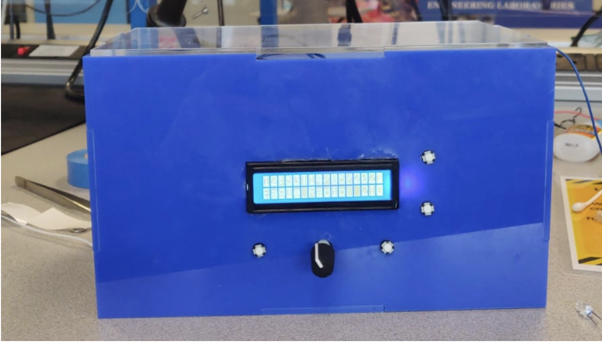
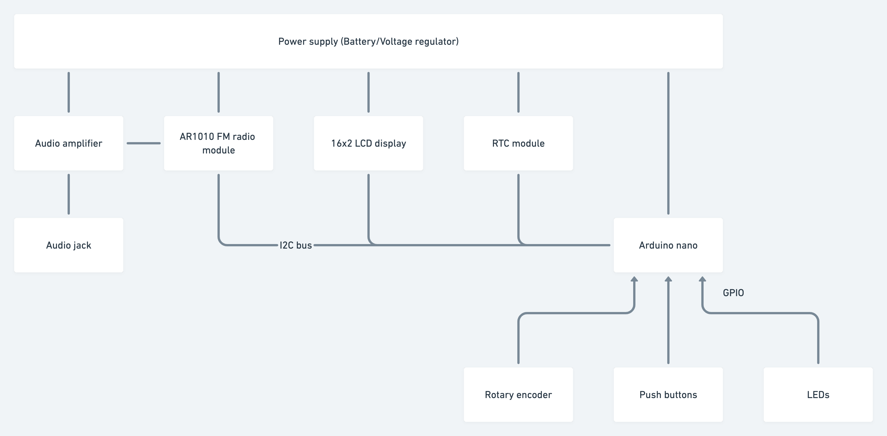
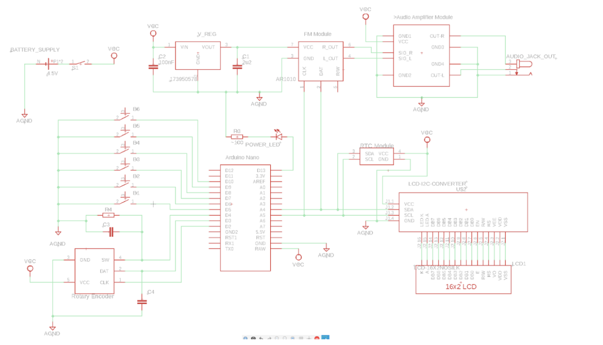

# ldps-fm-radio-project

> 2020/21 submission for the second year lab project by team 18 - University of Surrey
>
> By Sushant Misra, Awes Mubarak, Sara Pervez, Kareem Rifai, Robert Vasistha

## Features list

| Section     | Description                                                                                  | Achieved? |
| ----------- | -------------------------------------------------------------------------------------------- | --------- |
| General     | Power button to turn on/off device                                                           | ✓         |
| General     | LED inside the case displays on/off state                                                    | ✓         |
| Radio       | Outputs sound from a radio channel to aux                                                    | ✓         |
| Radio       | Uses frequency change buttons to seek up and down from the set frequency                     | ✓         |
| Radio       | Uses the memory buttons to Change to set frequency                                           | ✓         |
| RTC         | Persistently stores date and time after power off                                            | ✓         |
| RTC         | Uses the time change buttons to change the minute and hour                                   | ✓         |
| RTC         | Automatically sets the time and date to a sane value on initial startup                      | ✓         |
| Volume knob | Rotary encoder knob twists clockwise to increase volume and anticlockwise to decrease volume | ✓         |
| Volume knob | Rotary encoder pushes in to toggle mute mode                                                 | ✓         |
| LCD         | Displays the date and time by default                                                        | ✓         |
| LCD         | Displays the temperature, to the left most part of the second row                            | ✓         |
| LCD         | Displays the raw frequency on the second row                                                 | ✓         |
| LCD         | Updates the raw frequency to the station name after 2 seconds if available                   | ✓         |
| LCD         | Changes the entire display to a volume bar for 2 seconds after each volume change            | ✓         |
| Case        | Made of 6 panels of acrylic plastic, 5 transparent and the bottom one tinted blue            | ✓         |
| Case        | All but the top piece are held together with acrylic glue                                    | ✓         |
| Case        | Components held in with strong adhesive, and not loose                                       | ✓         |

## Usage guide

Turning on: the time will be set to the default value. Use the time set buttons
on the back of the device to set the correct time.

Changing frequency: use the two preset memory buttons to change the frequency to
EAGLE radio or BBC radio 4. Alternatively, use the two seek buttons to find the
next available frequency in each direction.

Changing volume: use the volume knob to change the volume. Pressing the knob in
will toggle the mute state.

Using the main display: look at the LCD for the  the date and time, current
frequency (updates to the channel name if available), the temperature, and the
volume when it is updated.

## Assembly guide

Required hardware:

-   AR1010
-   16x2 liquid crystal display
-   DS3231 RTC module
-   Arduino nano
-   Rotary encoder
-   6 push buttons
-   1 on/off toggle switch
-   battery holder for 4 AA batteries

Pin number layout:

| Arduino pin number | Description     |
| :----------------- | :-------------- |
| D5                 | Memory button 1 |
| D6                 | Memory button 2 |
| D7                 | Frequency up    |
| D8                 | Frequency down  |
| D9                 | Change minute   |
| D10                | Change hour     |

Circuit diagram:

1.  Assemble the circuit shown above
2.  Upload the code in this repository to the arduino
3.  Create an approprate box and integrate the circuit
